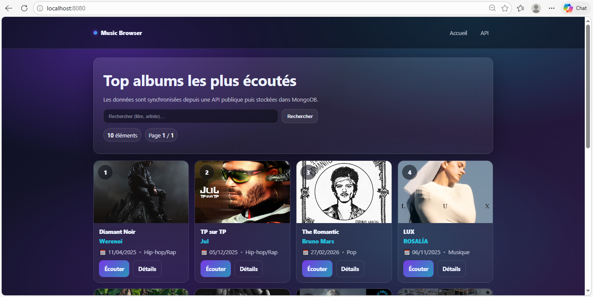
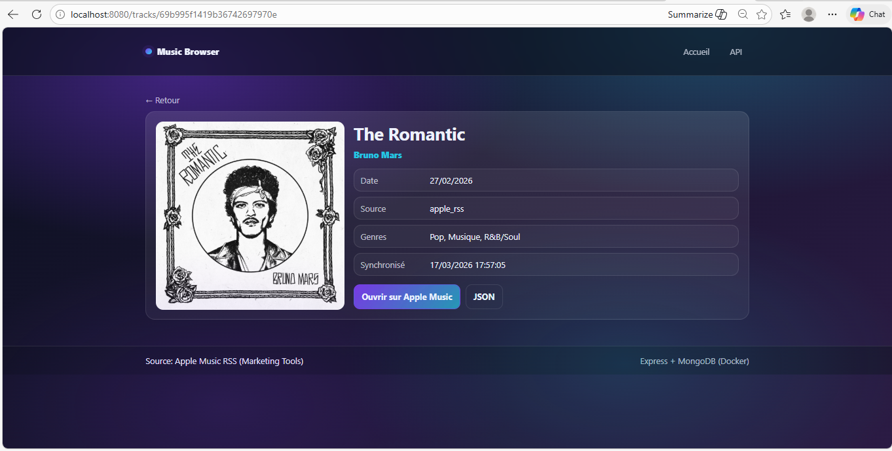

# Music Browser (Express + MongoDB + Docker)

Petit projet **Express.js** qui :

- récupère une liste de musiques/albums depuis une **API publique**
- les **stocke dans MongoDB**
- propose une **interface web** pour parcourir / rechercher
- expose une **API JSON** (`/api/tracks`)

Tout est pensé pour tourner avec **Docker** (sans Docker Compose).

## Aperçu




## Fonctionnalités

- **Web UI**: `/` (recherche + pagination) + page détail `/tracks/:id`
- **API**: `/api/tracks` et `/api/tracks/:id`
- **Sync**: `POST /admin/sync` (optionnellement protégé par token)
- **Healthcheck**: `/healthz`

## Prérequis

- Docker Desktop
- (Optionnel) Node.js 20+ si tu veux lancer en local sans Docker

## Variables d’environnement

Voir `.env.example`.

Variables importantes :

- **`MONGO_URI`**: URI de connexion MongoDB
- **`PORT`**: port HTTP (par défaut `8080`)
- **`SYNC_ON_START`**: `true/false` pour synchroniser au démarrage
- **`ADMIN_TOKEN`**: si défini, protège `POST /admin/sync` via l’en-tête `x-admin-token`
- **`APPLE_API_URL`**: URL API (optionnel)

## Lancer sans Docker (optionnel)

```bash
npm install
cp .env.example .env
npm run dev
```

Ouvre `http://localhost:8080`.

## Notes

- Les données viennent de l’endpoint Apple “Marketing Tools RSS”. Ce projet est un exemple pédagogique.

